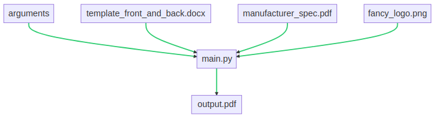
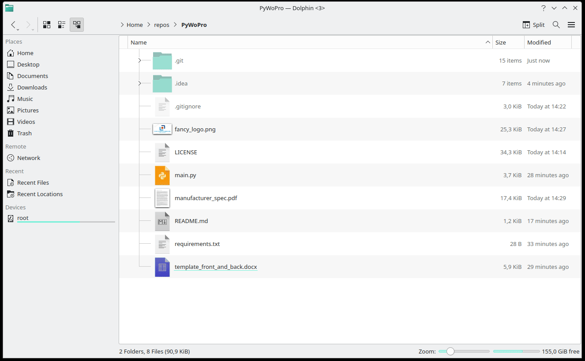

# PyWoPro
## What is this?
* Py(thon)Wo(rd)Pro(cessor to PDF)
* small helper to take a given word-template where certain fields should be replaced with specified data (text and images)
* then convert the very first page of the template to PDF as well as the second one
* combine it with a given additional manufacturer-spec-pdf into a single PDF which should use a distinct name-scheme


## Future development / known bugs
* placement & placeholder naming should be discussed - easily identifiable fields are better for parsing
* parsing of placeholders inside paragraphs still has a bug
* parameters to specify should be increased
* maybe a GUI would be helpful as well

## Usage
* needs Python 3.10 as well as the dependencies in the requirements and LibreOffice
install requirements:  
  `pip install -r requirements.txt `
* execute:  
  `time python3 main.py --template=template_front_and_back.docx --articleNumber=3.1415 --logo=fancy_logo.png --manufacturerSpec=manufacturer_spec.pdf`


## Note
In case of the following error:  
```
javaldx: Could not find a Java Runtime Environment!
Warning: failed to read path from javaldx
```
Solved by:  
`sudo pacman -S jre-openjdk-headless jre-openjdk jdk-openjdk openjdk-doc openjdk-src`
